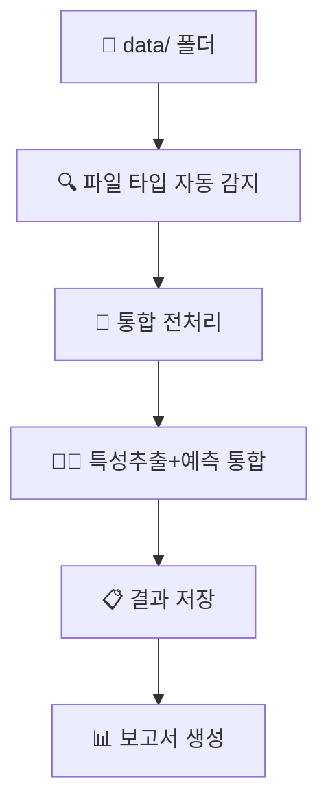
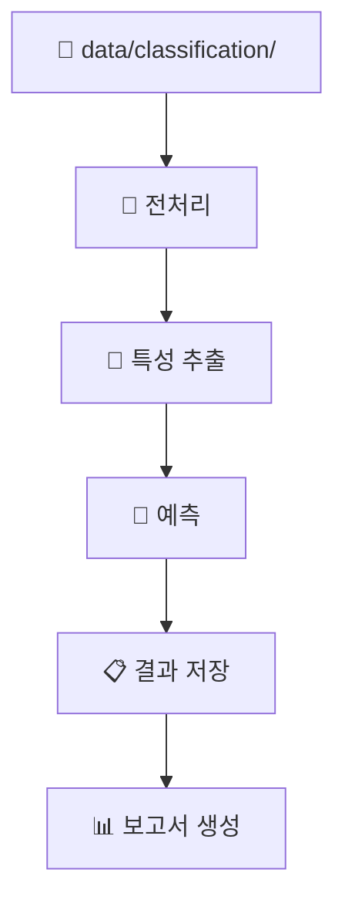

# 🎯 Feple LightGBM v2.0: 상담 품질 분류 자동화 시스템

**LG 팀 프로젝트** - 상담 대화 데이터를 분석하여 상담 품질을 자동으로 분류하는 AI 시스템


## 📋 목차
- [프로젝트 개요](#-프로젝트-개요)
- [새로운 기능 (v2.0)](#-새로운-기능-v20)
- [빠른 시작](#-빠른-시작)
- [시스템 구조](#-시스템-구조)
- [설치 및 설정](#-설치-및-설정)
- [사용 방법](#-사용-방법)
- [파일 구조](#-파일-구조)
- [API 문서](#-api-문서)
- [문제 해결](#-문제-해결)

## 🎯 프로젝트 개요

### 주요 기능
- **상담 품질 자동 분류**: 만족/미흡/해결불가/추가상담필요 4단계 분류
- **통합 파일 처리**: 한 폴더에 분류/요약/질의응답 데이터 혼합 처리 지원
- **실시간 모니터링**: JSON 파일 업로드 즉시 품질 분석 수행
- **예측 전용 모드**: 사전 학습된 모델로 빠른 예측 수행
- **배치 처리**: 여러 상담 세션 일괄 분석
- **웹 API**: RESTful API를 통한 외부 시스템 연동

### 분류 기준
1. **만족** - 고객이 상담 결과에 만족한 경우
2. **미흡** - 상담이 진행되었으나 고객 만족도가 낮은 경우
3. **해결 불가** - 고객의 문제를 해결할 수 없는 경우
4. **추가 상담 필요** - 추가적인 상담이나 처리가 필요한 경우

## 🆕 새로운 기능 (v2.0)

### 🔧 리팩토링 및 모듈화
- **통합 설정 관리**: `config.py`로 모든 설정 중앙화
- **공통 유틸리티**: `utils/` 패키지로 재사용 가능한 모듈 분리
- **향상된 로깅**: 구조화된 로깅 시스템 및 자동 로그 회전
- **타입 힌팅**: 전체 코드베이스에 타입 힌팅 적용

### 🚀 파이프라인 매니저
- **통합 파이프라인**: 한 번의 명령으로 전체 과정 실행
- **모드 선택**: unified/traditional 모드 지원
- **자동 보고서**: 실행 결과 자동 생성 및 저장
- **전제조건 검사**: 실행 전 시스템 요구사항 자동 확인

### 📁 유연한 파일 처리
- **통합 폴더 지원**: 한 `data/` 폴더에 모든 타입 파일 혼합 배치 가능
- **파일명 기반 분류**: 파일명으로 자동 타입 감지
- **스마트 세션 그룹화**: 세션 ID 기반 자동 파일 그룹화

### 🔍 향상된 모니터링
- **실시간 파일 감시**: 새 파일 추가시 즉시 처리
- **성능 모니터링**: 시스템 리소스 및 처리 성능 추적
- **오류 복구**: 인코딩 오류 자동 처리 및 복구

## 🚀 빠른 시작

### 1. 통합 파이프라인 실행 (권장)
```bash
# 기본 통합 모드
python pipeline_manager.py

# 기존 방식으로 실행
python pipeline_manager.py --mode traditional
```

### 2. 데이터 준비
**통합 폴더 방식 (v2.0 신기능):**
```bash
data/
├── 분류_세션123_1.json
├── 요약_세션123_1.json
├── 질의응답_세션123_1.json
├── classification_세션456_1.json
└── summary_세션456_1.json
```

**기존 폴더 구조:**
```bash
data/
├── classification/
├── summary/
└── qa/
```

### 3. 실시간 모니터링
```bash
# 통합 모니터링 시작
python auto_file_monitor_unified.py

# 새 파일을 data/ 폴더에 추가하면 자동 처리
```

### 4. 결과 확인
```bash
output/
├── text_features_all_v4.csv      # 특성 + 예측 결과
├── pipeline_report_*.json        # 상세 실행 보고서
├── pipeline_summary_*.txt        # 요약 보고서
└── monitoring.log                # 처리 로그
```

## 🏗️ 시스템 구조

### 리팩토링된 아키텍처
```
🎯 Feple LightGBM v2.0
├── 📋 config.py                   # 중앙 설정 관리
├── 🚀 pipeline_manager.py         # 통합 파이프라인 매니저
├── 🔄 auto_file_monitor_unified.py # 실시간 모니터링
├── 
├── 🛠️ utils/                      # 공통 유틸리티
│   ├── file_utils.py              # 파일 처리
│   ├── json_utils.py              # JSON 처리
│   ├── logger_utils.py            # 로깅
│   └── system_utils.py            # 시스템
├── 
├── 🔧 처리 스크립트/
│   ├── 1_preprocessing_unified.py  # 통합 전처리
│   ├── 2_extract_and_predict.py   # 특성추출+예측 통합
│   └── 4_model_predict_only.py    # 예측 전용
└── 
└── 📊 결과/
    ├── output/                    # 처리 결과
    ├── logs/                      # 로그 파일
    └── trained_models/            # 학습된 모델
```

### 파이프라인 플로우

#### 🔄 통합 모드 (unified)


#### 🔄 기존 모드 (traditional)


## 🛠️ 설치 및 설정

### 필수 요구사항
- **Python**: 3.7 이상
- **Java JDK**: 8 이상 (KoNLPy용)
- **메모리**: 최소 2GB RAM
- **디스크**: 최소 1GB 여유 공간

### 1. 저장소 클론 및 설정
```bash
# 저장소 클론
git clone <repository-url>
cd Feple_LightGBM

# 가상환경 생성 (권장)
python -m venv venv

# 가상환경 활성화
# Windows:
venv\Scripts\activate
# Linux/Mac:
source venv/bin/activate
```

### 2. 의존성 설치
```bash
# requirements.txt 생성 (아직 없다면)
echo "pandas>=1.3.0
numpy>=1.21.0
scikit-learn>=1.0.0
lightgbm>=3.0.0
transformers>=4.0.0
torch>=1.8.0
konlpy>=0.6.0
tqdm>=4.62.0
watchdog>=2.1.0
fastapi>=0.68.0
uvicorn>=0.15.0" > requirements.txt

# 패키지 설치
pip install -r requirements.txt
```

### 3. 시스템 설정 초기화
```bash
# 설정 및 디렉토리 초기화
python config.py
```

### 4. 모델 훈련 (최초 1회)
```bash
# dataset_v4 폴더의 데이터로 모델 훈련
python train_from_dataset_v4.py
```

## 📖 사용 방법

### 🎯 기본 사용법

#### 1. 통합 파이프라인 (권장)
```bash
# 기본 실행
python pipeline_manager.py

# 상세 로그와 함께 실행
python pipeline_manager.py --mode unified
```

#### 2. 실시간 모니터링 시스템
```bash
# 모니터링 시작
python auto_file_monitor_unified.py

# 백그라운드 실행 (Linux/Mac)
nohup python auto_file_monitor_unified.py &

# 백그라운드 실행 (Windows)
start /B python auto_file_monitor_unified.py
```

#### 3. 개별 단계 실행
```bash
# 1단계: 전처리 (통합 모드)
python 1_preprocessing_unified.py

# 2+4단계: 특성추출+예측 통합
python 2_extract_and_predict.py

# 4단계: 예측만 실행
python 4_model_predict_only.py
```

### 📁 입력 데이터 형식

#### JSON 파일 구조
```json
{
  "session_id": "123456",
  "consulting_content": "상담사: 안녕하세요...\n고객: 네, 안녕하세요...",
  "customer_id": "C123456", 
  "counselor_id": "CS789",
  "start_time": "2024-01-15 14:00:00",
  "end_time": "2024-01-15 14:15:00",
  "category": "대출상담",
  "instructions": [
    {
      "tuning_type": "분류",
      "data": [
        {
          "instruction": "상담 품질을 분류해주세요",
          "input": "상담 내용",
          "output": "만족"
        }
      ]
    }
  ]
}
```

#### 파일명 규칙 (통합 모드)
- **분류**: `분류_세션ID_번호.json`, `classification_세션ID_번호.json`
- **요약**: `요약_세션ID_번호.json`, `summary_세션ID_번호.json`
- **질의응답**: `질의응답_세션ID_번호.json`, `qa_세션ID_번호.json`

### 📊 결과 파일

#### 주요 출력 파일
```bash
output/
├── text_features_all_v4.csv           # 특성 + 예측 결과
├── accumulated_results.csv            # 누적 처리 결과  
├── pipeline_report_YYYYMMDD_HHMMSS.json  # 상세 보고서
├── pipeline_summary_YYYYMMDD_HHMMSS.txt  # 요약 보고서
└── monitoring.log                      # 모니터링 로그

results/
└── counseling_quality_predictions.csv  # 최종 예측 결과

logs/
├── pipeline_unified_YYYYMMDD.log      # 파이프라인 로그
├── monitoring.log                      # 모니터링 로그
└── system.log                          # 시스템 로그
```

#### 예측 결과 형식
```csv
session_id,predicted_label,confidence,processing_time
20593,만족,0.892,2.34
test_001,미흡,0.756,1.98
test_002,해결 불가,0.834,2.12
```

## 📁 파일 구조

### 🔧 핵심 시스템 파일
```bash
├── config.py                          # 🎯 중앙 설정 파일
├── pipeline_manager.py                # 🚀 통합 파이프라인 매니저
├── auto_file_monitor_unified.py       # 🔄 실시간 모니터링
└── requirements.txt                    # 📦 의존성 목록
```

### 🛠️ 유틸리티 모듈
```bash
utils/
├── __init__.py                        # 패키지 초기화
├── file_utils.py                      # 📁 파일 처리 유틸리티
├── json_utils.py                      # 📄 JSON 처리 유틸리티
├── logger_utils.py                    # 📝 로깅 유틸리티
└── system_utils.py                    # 🖥️ 시스템 유틸리티
```

### 🔧 처리 스크립트
```bash
├── 1_preprocessing_unified.py         # 📝 통합 전처리
├── 1_preprocessing_model_v3.py        # 📝 기존 전처리
├── 2_extract_and_predict.py           # 🔧🤖 통합 처리
├── 2_coloums_extraction_v3_json2csv.py # 🔧 특성 추출
├── 4_model_predict_only.py            # 🤖 예측 전용
└── train_from_dataset_v4.py           # 🏋️ 모델 훈련
```

### 📊 데이터 및 결과
```bash
data/                                  # 📁 입력 데이터
output/                                # 📊 처리 결과
results/                               # 📋 최종 결과
logs/                                  # 📝 로그 파일
trained_models/                        # 🤖 학습된 모델
dataset_v4/                           # 📚 훈련 데이터셋
```

## 🌐 API 문서

### FastAPI 서버 실행
```bash
# 개발 서버
uvicorn api.main:app --reload --port 8000

# 프로덕션 서버
uvicorn api.main:app --host 0.0.0.0 --port 8000 --workers 4
```

### 주요 엔드포인트

#### 헬스체크
```bash
GET /health
```

#### 상담 품질 평가
```bash
POST /evaluate/counseling-quality
Content-Type: application/json

{
  "session_id": "test_001",
  "consulting_content": "상담사: 안녕하세요...",
  "instructions": [...]
}
```

**응답:**
```json
{
  "session_id": "test_001",
  "predicted_label": "만족",
  "confidence": 0.892,
  "processing_time": 2.34,
  "features_extracted": 28,
  "model_version": "v2.0"
}
```

#### API 문서 확인
- **Swagger UI**: http://localhost:8000/docs
- **ReDoc**: http://localhost:8000/redoc

## 🔧 문제 해결

### 일반적인 문제

#### 1. 모델 파일이 없다는 오류
```bash
❌ 모델 파일 누락: trained_models/counseling_quality_model.pkl
```
**해결방법:**
```bash
# 모델 훈련 실행
python train_from_dataset_v4.py
```

#### 2. 인코딩 문제 (Windows)
```bash
UnicodeDecodeError: 'cp949' codec can't decode byte 0xec
```
**해결방법:**
```bash
# 자동 해결됨 (v2.0에서 자동 처리)
# 또는 수동 설정:
set PYTHONIOENCODING=utf-8
chcp 65001
python pipeline_manager.py
```

#### 3. 필수 패키지 누락
```bash
❌ 누락된 패키지: konlpy, transformers
```
**해결방법:**
```bash
pip install -r requirements.txt

# Java JDK 설치 (KoNLPy용)
# Windows: https://adoptopenjdk.net/
# Ubuntu: sudo apt install openjdk-11-jdk
# Mac: brew install openjdk@11
```

#### 4. 메모리 부족
```bash
❌ 메모리 부족: 1.2GB (최소 2GB 필요)
```
**해결방법:**
```python
# config.py에서 배치 크기 조정
TEXT_PROCESSING = {
    'batch_size': 16,  # 기본값 32에서 감소
    'device': -1       # CPU 모드 강제 사용
}
```

#### 5. 파일 처리 오류
```bash
❌ 처리할 JSON 파일이 없습니다
```
**해결방법:**
```bash
# 데이터 파일 확인
ls data/

# 파일명 규칙 확인 (통합 모드)
# 올바른 형식: 분류_세션123_1.json
# 잘못된 형식: session123.json
```

### 성능 최적화

#### 1. 시스템 리소스 모니터링
```bash
# 시스템 정보 확인
python -c "from utils import SystemUtils; print(SystemUtils.get_environment_summary())"

# 메모리 사용량 확인
python -c "from utils import SystemUtils; print(f'사용 가능 메모리: {SystemUtils.get_available_memory_gb():.1f}GB')"
```

#### 2. 배치 처리 최적화
```python
# config.py에서 성능 설정 조정
PERFORMANCE = {
    'max_workers': 2,      # CPU 코어 수에 맞게 조정
    'timeout': {
        'preprocessing': 600,      # 10분
        'feature_extraction': 1200, # 20분
        'prediction': 240          # 4분
    }
}
```

#### 3. 로그 레벨 조정
```python
# config.py에서 로깅 설정
LOGGING_CONFIG = {
    'level': 'WARNING',  # INFO에서 WARNING으로 변경하여 로그 감소
    'console_output': False,  # 콘솔 출력 비활성화
}
```

### 디버깅 및 모니터링

#### 실시간 로그 확인
```bash
# 파이프라인 로그
tail -f logs/pipeline_unified_$(date +%Y%m%d).log

# 모니터링 로그  
tail -f output/monitoring.log

# 시스템 로그
tail -f logs/system.log
```

#### 상세 디버그 모드
```bash
# 환경변수로 디버그 모드 활성화
export DEBUG=1
python pipeline_manager.py

# 또는 Python에서 직접
import logging
logging.basicConfig(level=logging.DEBUG)
```

#### 성능 프로파일링
```bash
# 성능 측정과 함께 실행
python -m cProfile -o profile_output.prof pipeline_manager.py

# 프로파일 결과 확인
python -c "import pstats; pstats.Stats('profile_output.prof').sort_stats('cumtime').print_stats(20)"
```

## 📈 로드맵

### v2.1 (예정)
- [ ] GPU 가속 지원
- [ ] 분산 처리 시스템
- [ ] 웹 대시보드
- [ ] 추가 언어 모델 지원

### v2.2 (예정)
- [ ] 클라우드 배포 지원
- [ ] 실시간 스트리밍 처리
- [ ] 모델 버전 관리
- [ ] A/B 테스트 프레임워크

## 🤝 기여

프로젝트에 기여하고 싶으시다면:

1. Fork the repository
2. Create a feature branch (`git checkout -b feature/amazing-feature`)
3. Commit your changes (`git commit -m 'Add amazing feature'`)
4. Push to the branch (`git push origin feature/amazing-feature`)
5. Open a Pull Request

## 📄 라이선스

이 프로젝트는 MIT 라이선스 하에 있습니다. 자세한 내용은 [LICENSE](LICENSE) 파일을 참조하세요.

## 📞 지원

- **Issues**: GitHub Issues를 통해 버그 리포트 및 기능 요청
- **Discussions**: GitHub Discussions를 통해 질문 및 토론
- **Email**: [project-email@example.com](mailto:project-email@example.com)

---

**Feple LightGBM v2.0** - 더 스마트하고, 더 빠르고, 더 쉬운 상담 품질 분류 시스템 🚀