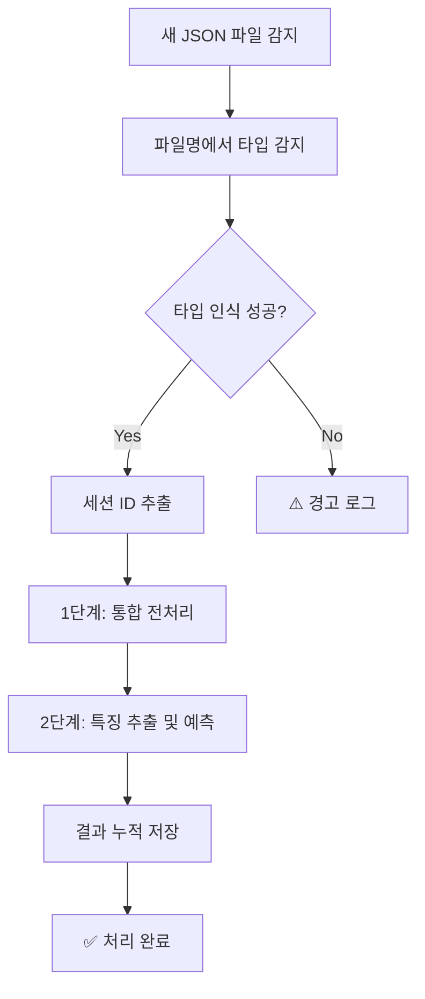

# 통합 폴더 기반 자동 처리 시스템 가이드

## 📋 개요

이 시스템은 **하나의 data 폴더**에 분류, 요약, 질의응답 데이터가 **파일명 기반으로 구분되어 들어와도** 자동으로 처리할 수 있는 통합 시스템입니다.

### 🎯 주요 특징
- **파일명 기반 자동 분류**: 분류/요약/질의응답을 파일명으로 구분
- **실시간 모니터링**: 새 파일이 추가되면 자동으로 처리
- **통합 결과 관리**: 모든 결과를 하나의 CSV에 누적 저장
- **상세 로깅**: 처리 과정 전체를 로그로 기록

---

## 🚀 빠른 시작

### 1. 시스템 구성 요소

```
프로젝트/
├── data/                           # 통합 입력 폴더
│   ├── 분류_세션123_1.json        # 분류 데이터
│   ├── 요약_세션123_1.json        # 요약 데이터
│   └── 질의응답_세션123_1.json    # 질의응답 데이터
├── 1_preprocessing_unified.py      # 통합 전처리 스크립트
├── 2_extract_and_predict.py       # 특징 추출 및 예측
├── auto_file_monitor_unified.py   # 자동 모니터링 시스템
└── output/                        # 결과 출력 폴더
    ├── text_features_all_v4.csv   # 최종 결과 (예측 포함)
    ├── accumulated_results.csv    # 누적 결과
    ├── monitoring.log             # 모니터링 로그
    └── summary_report.txt         # 요약 리포트
```

### 2. 자동 모니터링 시작

```bash
python auto_file_monitor_unified.py
```

### 3. 수동 전처리 (필요시)

```bash
python 1_preprocessing_unified.py
```

---

## 📝 지원하는 파일명 패턴

### ✅ 한국어 패턴
- `분류_세션ID_번호.json` (예: `분류_40017_1.json`)
- `요약_세션ID_번호.json` (예: `요약_40017_1.json`)
- `질의응답_세션ID_번호.json` (예: `질의응답_40017_1.json`)

### ✅ 영어 패턴
- `classification_세션ID_번호.json`
- `summary_세션ID_번호.json`
- `qa_세션ID_번호.json`

### ✅ 유연한 패턴
- `40017_분류_1.json` (세션ID가 앞에 와도 됨)
- `class_40017_1.json` (축약형도 지원)
- `sum_40017_1.json`
- `question_40017_1.json`

---

## 🔄 처리 워크플로우

### 자동 처리 과정



### 1단계: 통합 전처리
- 파일명 기반으로 분류/요약/질의응답 구분
- 세션별 데이터 병합
- 중복 input 필드 제거
- `json_merge/` 폴더에 결과 저장

### 2단계: 특징 추출 및 예측
- 텍스트 특징 추출 (감정, 형태소, 패턴 등)  
- LightGBM 모델로 상담 품질 예측
- `output/text_features_all_v4.csv`에 결과 저장

---

## 📊 결과 파일 구조

### `text_features_all_v4.csv` (최종 결과)
```csv
session_id,predicted_label,confidence,고객_emo_기쁨_star_score,...
20593,만족,0.771,0.2,...
20594,추가 상담 필요,0.823,0.1,...
```

### `accumulated_results.csv` (누적 결과)
```csv
session_id,predicted_label,confidence,processed_time,source_file,data_type,...
20593,만족,0.771,2024-01-15 14:30:25,분류_20593_1.json,분류,...
```

---

## ⚙️ 사용 방법

### A. 자동 모니터링 모드 (권장)

1. **시스템 시작**
   ```bash
   python auto_file_monitor_unified.py
   ```

2. **파일 추가**
   - `data/` 폴더에 JSON 파일 복사
   - 시스템이 자동으로 감지하여 처리

3. **결과 확인**
   - `output/text_features_all_v4.csv`: 최신 처리 결과
   - `output/accumulated_results.csv`: 모든 처리 기록
   - `output/monitoring.log`: 상세 처리 로그

### B. 수동 처리 모드

1. **파일 준비**
   ```bash
   # data 폴더에 JSON 파일들 배치
   data/
   ├── 분류_40017_1.json
   ├── 분류_40017_2.json
   ├── 요약_40017_1.json
   └── 질의응답_40017_1.json
   ```

2. **전처리 실행**
   ```bash
   python 1_preprocessing_unified.py
   ```

3. **예측 실행**
   ```bash
   python 2_extract_and_predict.py
   ```

---

## 📈 모니터링 기능

### 실시간 로그
```
🆕 새 파일 감지: 분류_40017_1.json
   타입: 분류
   세션 ID: 40017
🔄 파일 처리 시작: 분류_40017_1.json
   [1단계] 전처리 실행...
   ✅ 전처리 완료
   [2단계] 특징 추출 및 예측...
   ✅ 특징 추출 및 예측 완료
   📈 누적 결과 저장: 1개 세션
   📊 새 예측 결과:
      만족: 1개
✅ 파일 처리 완료: 분류_40017_1.json
```

### 요약 리포트 (1분마다 업데이트)
```
📊 통합 처리 결과 요약 (2024-01-15 14:30:25)
============================================================

📈 전체 통계:
  • 총 처리된 세션: 21개
  • 처리된 데이터 타입: 1개

🎯 예측 결과 분포:
  • 만족: 19개 (90.5%)
  • 추가 상담 필요: 2개 (9.5%)

🔍 신뢰도 분석:
  • 평균 신뢰도: 83.5%
  • 고신뢰도 예측 (≥80%): 14개 (66.7%)

📋 데이터 타입별 분포:
  • 분류: 21개
```

---

## 🔧 고급 설정

### 파일 타입 키워드 수정
`auto_file_monitor_unified.py` 파일에서 수정:

```python
self.file_type_keywords = {
    '분류': ['분류', 'classification', 'class', 'classify'],
    '요약': ['요약', 'summary', 'sum', 'summarize'],
    '질의응답': ['질의응답', 'qa', 'qna', 'question', 'answer']
}
```

### 모니터링 폴더 변경
```python
# 기본값
monitor_dir = "data"
output_dir = "output"

# 사용자 정의
monitor_dir = "input_data"
output_dir = "results"
```

---

## 🚨 문제 해결

### 1. 파일 타입 인식 안 됨
**문제**: `⚠️ 알 수 없는 파일 타입: example.json`

**해결**: 파일명에 타입 키워드 포함
```bash
# ❌ 인식 안 됨
example.json

# ✅ 인식 됨
분류_example.json
classification_example.json
```

### 2. 세션 ID 추출 실패
**문제**: 세션 ID가 'unknown'으로 표시

**해결**: 파일명에 숫자 포함
```bash
# ❌ 숫자 없음
분류_session.json

# ✅ 숫자 있음
분류_40017_1.json
분류_session_40017.json
```

### 3. 전처리 실패
**문제**: `❌ 전처리 실패 - 출력 폴더 없음`

**해결**: 
- JSON 파일 형식 확인
- 필수 필드(`consulting_content`, `instructions`) 존재 확인
- 로그 파일에서 상세 오류 확인

### 4. 예측 실패
**문제**: `❌ 특징 추출 및 예측 실패 - 결과 파일 없음`

**해결**:
- 모델 파일 존재 확인 (`trained_models/*.pkl`)
- 전처리 결과 확인 (`json_merge/` 폴더)
- 필요시 모델 재훈련: `python train_from_dataset_v4.py`

---

## 📚 추가 정보

### 관련 스크립트들
- `train_from_dataset_v4.py`: 모델 훈련
- `classification_pipeline_v3.py`: 기존 파이프라인 (분리 폴더 방식)
- `1_preprocessing_model_v3.py`: 기존 전처리 (분리 폴더 방식)

### 성능 최적화
- **배치 처리**: 여러 파일을 한 번에 처리
- **메모리 관리**: 대용량 파일 스트리밍 처리
- **병렬 처리**: 멀티프로세싱으로 속도 향상

### 확장 가능성
- **새로운 데이터 타입 추가**: 키워드만 추가하면 됨
- **다양한 출력 형식**: CSV, JSON, Excel 등
- **API 연동**: REST API로 실시간 처리
- **클라우드 연동**: AWS S3, Google Drive 등

---

## 🎉 결론

이 통합 처리 시스템을 사용하면:

✅ **편리성**: 하나의 폴더에 모든 파일 관리  
✅ **자동화**: 파일 추가만으로 전체 처리 완료  
✅ **유연성**: 다양한 파일명 패턴 지원  
✅ **모니터링**: 실시간 처리 상태 확인  
✅ **확장성**: 새로운 데이터 타입 쉽게 추가

**기존 분리 폴더 방식**과 **통합 폴더 방식** 모두 지원하므로, 상황에 맞게 선택하여 사용하시면 됩니다! 